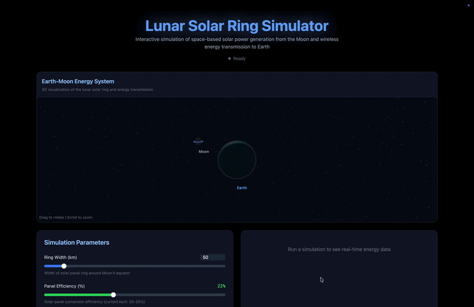

# Lunar Solar Ring Simulator

A full-stack interactive simulation platform that models a futuristic concept of generating solar energy from the Moon and transmitting it wirelessly to Earth.

> Inspired by next-generation space-based solar power systems.

---

## Demo



---

## Features

- **3D Moon Visualization** with realistic texture using Three.js
- **Energy Beam Animation** simulating Moon → Earth transmission
- **Interactive Energy Graphs** with real-time updates via Plotly.js
- **AI-like Insights Engine** with auto-generated analysis
- **Dynamic Simulation Controls** with slider-based inputs
- **Futuristic UI** featuring dark theme, glow effects, and animations
- **Real-time Simulation Execution** via FastAPI backend
- **Premium Dashboard Experience** with responsive design

---

## How It Works

The system simulates a conceptual energy pipeline:

```
Solar Energy on Moon → Energy Generation → Wireless Transmission → Earth Reception
```

### Simulation Components

| Component | Description |
|-----------|-------------|
| **Lunar Ring Model** | Estimates solar panel coverage across the lunar equator |
| **Energy Generation Engine** | Calculates total energy based on efficiency and panel area |
| **Transmission Model** | Applies loss factors based on distance and medium (microwave/laser) |
| **Earth Receiver Model** | Computes usable energy received on Earth via ground stations |
| **Insights Engine** | Generates intelligent observations from simulation results |

---

## Tech Stack

### Backend
| Technology | Purpose |
|------------|---------|
| Python 3.13+ | Core language |
| FastAPI | REST API framework |
| Pydantic | Data validation |
| NumPy | Numerical computations |
| Plotly | Graph generation |

### Frontend
| Technology | Purpose |
|------------|---------|
| React 19 | UI framework |
| TypeScript | Type safety |
| Vite | Build tool |
| Tailwind CSS | Styling |
| Framer Motion | Animations |
| Plotly.js | Interactive charts |

### 3D Visualization
| Technology | Purpose |
|------------|---------|
| Three.js | 3D rendering |
| React Three Fiber | React renderer for Three.js |
| Drei | Useful helpers for R3F |

---

## Project Structure

```
lunar_solar_ring_simulator/
├── api.py                    # FastAPI application entry point
├── main.py                   # CLI simulation runner
├── constants/
│   └── physical_constants.py # Moon radius, solar irradiance, etc.
├── models/
│   ├── input_model.py        # Pydantic input validation
│   └── output_model.py       # Output data structures
├── simulation/
│   ├── orchestrator.py       # Main simulation coordinator
│   ├── lunar_ring.py         # Lunar ring area calculations
│   ├── energy_model.py       # Energy generation logic
│   ├── transmission_model.py # Transmission loss calculations
│   └── earth_receiver.py     # Ground station reception
├── utils/
│   └── logger.py             # Logging utilities
└── lunar-frontend/           # React frontend application
    ├── src/
    │   ├── App.tsx           # Main application component
    │   ├── components/       # UI components
    │   │   ├── SimulationForm.tsx
    │   │   ├── Results.tsx
    │   │   ├── EnergyGraph.tsx
    │   │   ├── Insights.tsx
    │   │   ├── MoonVisual.tsx
    │   │   ├── MoonBackground.tsx
    │   │   └── EnergyBeam.tsx
    │   ├── services/
    │   │   └── api.ts        # API client
    │   └── utils/
    │       └── insights.ts   # Insights generation
    └── package.json
```

---

## Installation & Setup

### Prerequisites

- Python 3.13+
- Node.js 18+
- npm or yarn

### 1. Clone Repository

```bash
git clone https://github.com/your-username/lunar-solar-simulator.git
cd lunar-solar-simulator
```

### 2. Backend Setup

```bash
# Create and activate virtual environment
python3 -m venv venv
source venv/bin/activate  # On Windows: venv\Scripts\activate

# Install dependencies
pip install fastapi uvicorn pydantic numpy plotly

# Start the API server
uvicorn api:app --reload
```

Backend will run at: http://127.0.0.1:8000

API documentation available at: http://127.0.0.1:8000/docs

### 3. Frontend Setup

```bash
cd lunar-frontend

# Install dependencies
npm install

# Start development server
npm run dev
```

Frontend will run at: http://localhost:5173

---

## API Endpoints

| Method | Endpoint | Description |
|--------|----------|-------------|
| GET | `/` | Health check |
| POST | `/simulate` | Run simulation with input parameters |
| POST | `/simulate-with-graph` | Run simulation and return graph data |

### Simulation Input Parameters

```json
{
  "ring_width_km": 50,
  "panel_efficiency": 0.22,
  "transmission_type": "microwave",
  "num_ground_stations": 5
}
```

| Parameter | Type | Range | Description |
|-----------|------|-------|-------------|
| `ring_width_km` | float | 0-500 | Width of the solar panel ring on the Moon |
| `panel_efficiency` | float | 0-1 | Solar panel conversion efficiency |
| `transmission_type` | string | microwave/laser | Energy transmission method |
| `num_ground_stations` | int | 1-100 | Number of Earth receiving stations |

### Simulation Output

```json
{
  "total_energy_generated_gw": 1234.56,
  "energy_received_gw": 987.65,
  "transmission_loss_percent": 20.0,
  "system_efficiency": 0.80
}
```

---

## Physical Constants

The simulation uses the following physical constants:

| Constant | Value | Unit |
|----------|-------|------|
| Moon Radius | 1,737 | km |
| Solar Irradiance | 1,361 | W/m² |
| Earth-Moon Distance | 384,400 | km |

---

## Development

### Running Tests

```bash
# Backend tests (if available)
pytest

# Frontend tests
cd lunar-frontend
npm test
```

### Building for Production

```bash
# Frontend build
cd lunar-frontend
npm run build
```

---

## Screenshots

> Add your screenshots in the `screenshots/` directory

---

## Contributing

1. Fork the repository
2. Create a feature branch (`git checkout -b feature/amazing-feature`)
3. Commit your changes (`git commit -m 'Add amazing feature'`)
4. Push to the branch (`git push origin feature/amazing-feature`)
5. Open a Pull Request

---

## License

This project is open source and available under the [MIT License](LICENSE).

---

## Acknowledgments

- Inspired by the [Shimizu Corporation's Luna Ring concept](https://www.shimz.co.jp/en/topics/dream/content03/)
- Three.js community for 3D visualization resources
- FastAPI for the excellent Python web framework
